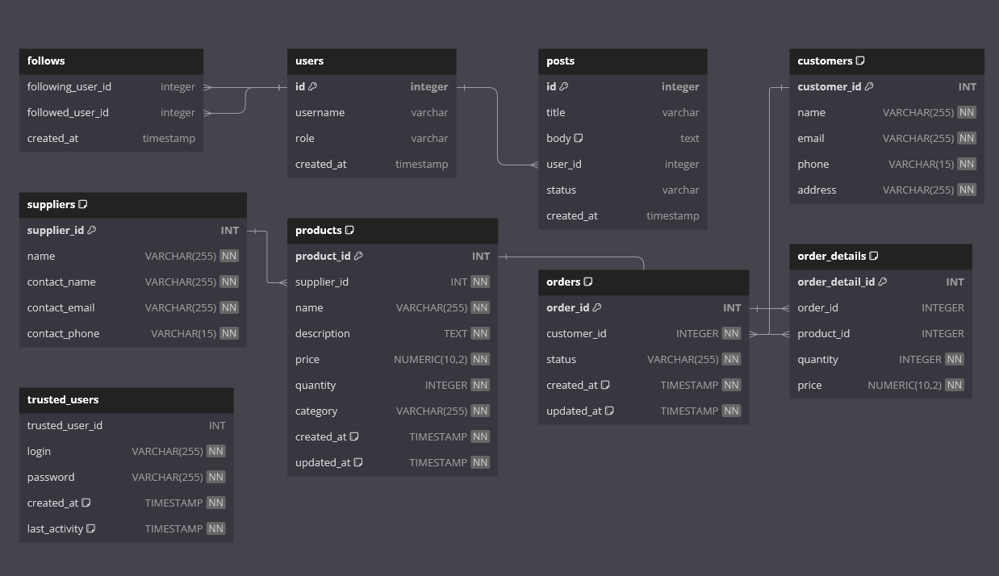

<p align="center">
    
</p>
<p align="center">
    
    
    
    
    
</p>

<hr>

Inventory Management System is designed for small and medium-sized businesses that need to improve inventory accounting, order management and supplier interactions. The system is developed in Go language using PostgreSQL for the database.

## Features

* **Product Management**
  * **Add, delete and modify items:** Users can easily add new items to the system, delete unwanted items and modify information about existing items.
  * **Product Categorization:** Products can be categorized, making it easy to navigate and find the right products.
  * **Inventory Tracking:** The system automatically tracks the quantity of each item in stock, alerting you to low inventory.
* **Order Management**
  * **Order creation:** Users can create orders by selecting items from the catalog and specifying the desired quantity.
  * **Order Status Management:** Orders can have different statuses (new, in process, shipped, delivered) to help track their current status.
  * **Automatic stock update:** When an order is created, the system automatically updates stock data.
* **Supplier Interaction**
  * **Supplier Data Management:** Ability to add and manage supplier information including company name, contact information.
  * **Automate Purchase Requests:** The system can automatically send requests to suppliers to replenish inventory.
* **Analytics and Reporting**
  * **Sales and Inventory Reports:** Generate detailed sales, inventory and order reports to analyze business performance.
  * **Product Requirement Forecasting:** Utilize sales and order data to forecast future product requirements.
* **Technology Integrations**
  * **Using JWT for authentication:** Secure user sessions via JSON Web Tokens.
  * **Support for Docker and GitHub Actions:** Simplify deployment and automate CI/CD processes with Docker and GitHub Actions.
* **Convenient logging of all actions and errors**
  * Indicates what has been done 
  * Indicates who sent the request

## Database Overview

The database is designed to support a versatile system handling multiple entities such as customers, suppliers, products, orders, and user authentication. Below is a detailed breakdown of each table and its role within the system:



For more information check [SQL directory](sql/)

### Tables

* **Customers:** Stores customer information including a unique ID, name, email, phone number, and address. Each customer's email and phone number are unique to ensure accurate identification.
* **Suppliers:** Contains data about suppliers such as their ID, name, contact details, and contact methods. Unique constraints on contact email and phone guarantee no overlap in supplier contacts.
* **Products:** Manages product listings including ID, supplier linkage, unique name, description, pricing, stock quantity, and category. It maintains links to suppliers through foreign keys.
* **Orders:** Tracks order transactions including the order ID, linked customer, status, and timestamps. Foreign keys link each order to a specific customer.
* **Order Details:** Details line items in orders, including the IDs of the order and product, quantity, and price. Ensures integrity of references to orders and products through foreign keys.
* **Trusted Users:** Designed for user authentication and access control. It holds user login credentials and timestamps for activities. Trusted users can obtain a JWT token valid for 24 hours for secure operations. [Initial trusted user data](sql/trusted_users/base_add_trusted_users.sql) is seeded from a file if no users exist; otherwise, manual insertion via SQL is required.

For more information read [SQL file](sql/create_tables.sql).

### Security Features

The database implements robust security measures including unique constraints, foreign key constraints, and timestamp tracking to ensure data integrity and security. Special attention is given to user authentication through the "Trusted Users" table, which integrates tightly with JWT token issuance for secure application access.

## Getting started

1. Edit the [configuration file](config.yml)
    ```yml
    env: "local"\"dev"\"prod    <- CHOOSE ONE
    secret_key: "admin"         <- EDIT ME
    http_server:
      address: "0.0.0.0:8080" 
      timeout: 4s
      idle_timeout: 30s
    database:
      name: db_name             <- EDIT ME
      user: db_admin            <- EDIT ME
      password: db_password     <- EDIT ME
      host: database            <- EDIT ME
      port: 5432
    ```
2. [Register](sql/trusted_users/base_add_trusted_users.sql) multiple trusted users

    Example:
    ```sql
    INSERT INTO trusted_users (login, password) VALUES ('likimiad', '123');
    INSERT INTO trusted_users (login, password) VALUES ('admin', '123');
    ```
3. Select one of the startup options
   * Run the project locally
        Warning: Make sure you have PostgreSQL installed
        ```cmd
        git clone git@github.com:LikimiaD/api-inventory-management-system.git
        go mod download
        make build
        .\main
        ```
   * Run the application using docker compose
       ```cmd
       git clone git@github.com:LikimiaD/api-inventory-management-system.git
       make docker-build
       make docker-start
       ```
You can study [Makefile](Makefile), [Dockefile](Dockerfile) and [docker-compose](docker-compose.yml) for better understanding.

## Logging

The usual implementation via slog logger, outputs a detailed report for each request, warnings and errors.
```cmd
app-1     | time=2024-04-19T10:53:12.573Z level=ERROR msg="Database CheckSupplierExists() -> Read SQL file" env=local !BADKEY="open sql/products/check_supplier_exists.sql: no such file or directory"
app-1     | time=2024-04-19T10:53:12.573Z level=ERROR msg="server side -> addProduct() -> s.DB.CheckSupplierExists()" env=local !BADKEY="open sql/products/check_supplier_exists.sql: no such file or directory

app-1     | time=2024-04-19T10:55:27.478Z level=INFO msg="User likimiad created new product with name Tomato and id 1" env=local
app-1     | time=2024-04-19T10:55:51.732Z level=INFO msg="User likimiad created new product with name Cucumber1 and id 2" env=local
app-1     | time=2024-04-19T10:55:56.395Z level=INFO msg="User likimiad created new product with name Carrot2 and id 3" env=local
app-1     | time=2024-04-19T10:56:00.908Z level=INFO msg="User likimiad created new product with name Potato1 and id 4" env=local
app-1     | time=2024-04-19T10:56:05.173Z level=INFO msg="User likimiad created new product with name Bell Pepper5 and id 5" env=local
app-1     | time=2024-04-19T10:56:09.466Z level=INFO msg="User likimiad created new product with name Broccoli3 and id 6" env=local
app-1     | time=2024-04-19T10:56:14.333Z level=INFO msg="User likimiad created new product with name Onion2 and id 7" env=local
app-1     | time=2024-04-19T10:56:21.271Z level=INFO msg="User likimiad created new product with name Garlic1 and id 8" env=local

app-1     | time=2024-04-19T11:00:39.979Z level=INFO msg="User likimiad requested information on category 'vegetable' products in json format" env=local
app-1     | time=2024-04-19T11:01:25.000Z level=INFO msg="User likimiad requested information on products priced between 100 and 120 in json format" env=local
app-1     | time=2024-04-19T11:01:31.272Z level=INFO msg="User likimiad requested information on products priced between 100 and 140 in json format" env=local
app-1     | time=2024-04-19T11:02:00.777Z level=INFO msg="User likimiad requested information on products priced between 2 and 7 in json format" env=local
app-1     | time=2024-04-19T11:02:45.371Z level=INFO msg="User likimiad requested purchase requests in json format" env=local
```

## API Docs
[Visually clear and simple documentation](docs/API.md)

## License
This project is licensed under the MIT License - see the [LICENSE](LICENSE) file for details.
